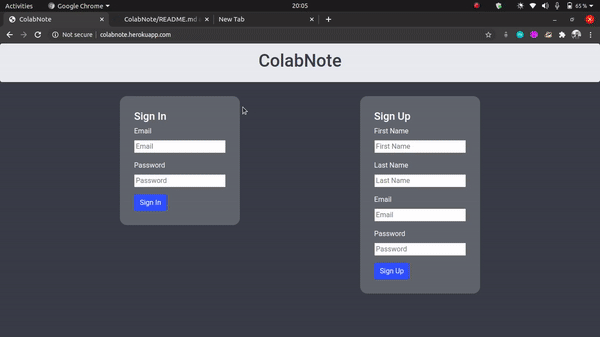

# ColabNote
This is a collaborative text editor that allows realtime text editing among users. The text editor is built using the MERN stack and on top of [Slate.js](https://github.com/ianstormtaylor/slate). The collaborative editing part is implemented using web sockets with the help of [Socket.io](https://github.com/socketio/socket.io). Authentication using [bcrypt](https://www.npmjs.com/package/bcrypt) and authorization using tokens.

The project is live here - [ColabNote](http://colabnote.herokuapp.com/)

Table Of Contents
=================

<!--ts-->
   * [Features](#features)
   * [Instructions To Run](#instructions-to-run)
   * [Demo](#demo)
   * [Possible Improvements](#possible-improvements)
<!--te-->

Features
=================
1. User account creation
2. Create, edit and delete notes
3. Sharing notes with other users
4. Real-time editing
5. Notes are autosaved after every typed letter

Instructions To Run
=====================
1. run ```npm install``` in the <b>/colabnote</b> directory
2. run ```npm install``` in the <b>/server</b> directory
3. Add a ```.env``` file containing the environment variables for your MongoDB cluster in the following format ```MONGOURL=<yoururl>```
4. start server by running ```node src/index.js``` in the <b>/server</b> directory
5. run ```npm start``` in the <b>/colabnote</b> directory to start the frontend


Demo
=====================


Possible Improvements
======================
1. Implementing <b>OT</b> or <b>CRDT</b> to synchronise changes between users to account for network latency.
2. Showing history of note changes / implementing something like <b>version control</b>.
3. Adding support for <b>rich text</b> notes, currently only plain text notes can be created.
4. Implementing <b>OAuth</b> for authentication.
5. Token based authorisation using <b>JWTs</b>, currently a very bare-bones approach has been followed.
6. Creating <b>API keys</b> for the note and user APIs.
